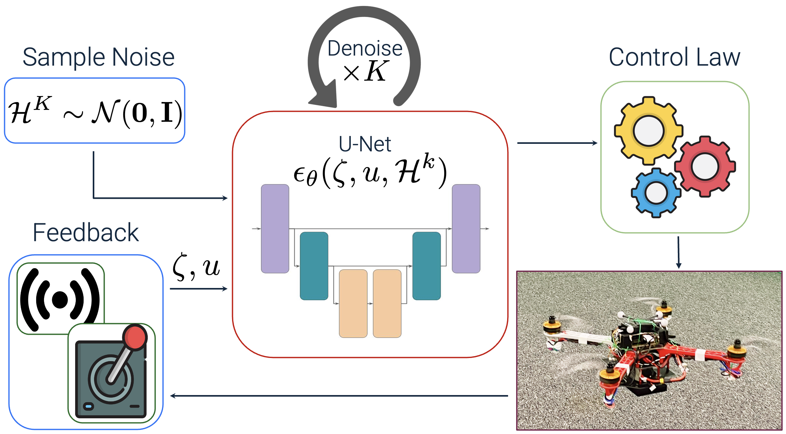

<h1 align="center">DroneDiffusion: Robust Quadrotor Dynamics Learning with Diffusion Models</h1>

<p align="center">
       <a href="https://github.com/google/jax">
        </a>
        <a href="https://github.com/psf/black">
        </a>
       <a href= "https://github.com/avirupdas55/DroneDiffusion/blob/main/LICENSE">
        </a>
       <a href= "https://arxiv.org/abs/2409.11292">
        </a>
</p>
<p align="center">
  
</p>

[Overview](#overview) | [Installation](#installation) | [Dataset](#dataset) | [Config](#config) | [Training](#training) | [Inference](#inference) | [Simulation](#simulation) | [Structure](#structure) | [Citation](#citation)
---

<div class="row" align="centre">
            
            
            
        </div>

<h2 name="overview" id="overview"> Overview 🚁 </h2>

This repository provides a JAX implementation of the diffusion-based controller (DM-AC) described in our [paper](https://arxiv.org/abs/2409.11292)(check out videos at our [project page](https://sites.google.com/view/dronediffusion)). By learning a probabilistic model of the dynamics uncertainty, DM-AC delivers robust trajectory tracking under disturbances such as payload variations and wind gusts. We provide the controller used for the  experiments which can be hooked into PX4 SITL via Gazebo and ROS 1/MAVROS for real-time control. Both training and inference are fully configurable, with JAX ensuring high-performance and fast experimentation.

We aim to provide a clear, modular, and extensible codebase for rapid prototyping of **diffusion-based system identification** for **real-time** deployment (all of our experiments were conducted on a workstation with a single RTX4080). We model system dynamics using the Euler-Lagrange formulation:
```math
 \bar{M} \ddot{q} + \bar{C} \dot{q} + \bar{f} + \mathcal{H} = u
```

Each training sample consists of a **state**: $\{q, \dot{q}, \ddot{q}, u\}$ and an **action**: $\{u - \bar{M} \ddot{q} - \bar{C} \dot{q} - \bar{f}\}$ . The diffusion model learns the residual term $\mathcal{H}$, which captures unmodeled dynamics and disturbances such as wind, drag, or payload changes. The repository can also be used for training the diffusion model to generate control inputs directly.


<h2 name="installation" id="installation"> Installation 🧗 </h2>

This project requires **Python 3.10.15**.

1. **Clone the repository**
   ```bash
   git clone https://github.com/yourusername/your-repo.git
   cd your-repo
   ```

2. **Create a virtual environment** (recommended)
  We recommend installing all python dependencies in a virtual environment. This is also applicable if you are running your controller stack in Docker.

   ```bash
   python3 -m venv dmac
   source dmac/bin/activate
   ```

3. **Install JAX with CUDA support and other dependencies**

   ```bash
   pip install --upgrade pip
   pip install -U "jax[cuda12_pip]==0.4.26" -f https://storage.googleapis.com/jax-releases/jax_cuda_releases.html
   pip install -r requirements.txt

   对dmac/bin/activate写入export LD_LIBRARY_PATH="/home/server/Desktop/DroneDiffusion/dmac/lib/python3.10/site-packages/nvidia/cuda_runtime/lib:/home/server/Desktop/DroneDiffusion/dmac/lib/python3.10/site-packages/nvidia/cudnn/lib:$LD_LIBRARY_PATH"
   
   echo $LD_LIBRARY_PATH
   ```

> **Note:** ROS is not included as a dependency for this project, please see the [intended use](#overview).

<h2 name="dataset" id="dataset"> Dataset 📂 </h2>

We encourage you to adapt this codebase to your own robotic platforms, no hard‑coded state or control dimensions here! The scripts will automatically infer the shapes of `states` and `controls` from  `./dataset/data.pkl`.

1. Record your data in `.csv` files (trajectories with different mass, velocity, etc.) and place them inside `./dataset/`. Each `.csv` file should contain one trajectory.

2. Run the following:
   ```bash
   python3 data/prepare_data.py
   ```
   This will create `./dataset/data.pkl` with the following keys:

   - `states`: an `np.ndarray` of state vectors
   - `actions`: an `np.ndarray` of controls
   - `terminals`: an `np.ndarray` of trajectory terminal flags (1 denotes the end of the current trajectory)

3. This would also give you the length of the longest trajectory in your data:
   ```bash
   Data preparation complete.
   Please set `max_path_length` to 29790 in your config file.
   ```
   This would be used for padding the data for training the diffusion model.


<h2 name="config" id="config"> Config 📝 </h2>

All configs required for training the diffusion model can be specified with a `.yaml` file in `./config/`. 

|     **Field**    |  **Type** |                          **Description**                          |
|:----------------:|:---------:|:-----------------------------------------------------------------:|
| dataset_path     |    str    | Directory of the pickle file.                                     |
| horizon          |    int    | No. of time steps the diffusion model predicts (H).               |
| max_path_length  |    int    | Max trajectory length in the data, used for padding.              |
| batch_size       |    int    | Number of samples per training batch.                             |
| dim              |    int    | Base channel width of the noise-predictor (U-Net).                |
| attention        |    bool   | If True, uses linear attention at each resolution of the U-Net.   |
| dim_mults        | List[int] | Multipliers for each U-net stage.                                 |
| n_timesteps      |    int    | No. of diffusion steps (K).                                       |
| predict_epsilon  |    bool   | Whether the model predicts the noise (epsilon) during denoising.  |
| clip_denoised    |    bool   | Whether to clip the denoised output to [-1,1] during sampling.    |
| total_steps      |    int    | Total training steps.                                             |
| learning_rate    |   float   | Learning rate for the optimizer (Adam).                           |
| grad_accum_steps |    int    | Number of gradient accumulation steps before an optimizer update. |
| ema_decay        |   float   | Exponential Moving Average (EMA) decay rate for model weights.    |
| update_ema_every |    int    | No. of steps between EMA model updates.                           |
| warmup_steps     |    int    | No. of training steps to wait before starting EMA updates.        |
| prefetch_batches |    int    | No. of batches to prefetch on device.                             |
| seed             |    int    | Random seed for initialization and training.                      |
| workdir          |    str    | Directory for checkpointing.                                      |
| log_every        |    int    | Frequency of training logs.                                       |
| save_every       |    int    | Frequency of model checkpointing.                                 |
| resume           |    bool   | Whether to resume training from previous checkpoint.              |

If you are not sure about these parameters for your data, we recommend starting with our example `experiment.yaml` and tune accordingly.

<h2 name="training" id="training"> Training ⚙️ </h2>

Once the data and config are set up, launch the training:

```bash
python3 scripts/train.py --config experiment.yaml
```

Remember to replace `experiment.yaml` with your own YAML-config. Once the training starts, all logs will be reflected in a `training.log` file in `workdir`:

```log
2025-07-12 21:43:28,149 - INFO - [Dataset] horizon: 16, max_path_length: 73000
2025-07-12 21:43:48,418 - INFO - Trainer initialized with workdir: /someDir/tHisRePo/checkpoints
2025-07-12 21:43:48,419 - INFO - Starting training from scratch.
2025-07-12 21:44:31,159 - INFO - Step 100/10000, Loss: 0.0506
2025-07-12 21:44:32,164 - INFO - Step 200/10000, Loss: 0.0360
2025-07-12 21:44:33,048 - INFO - Step 300/10000, Loss: 0.0255
```

<h2 name="inference" id="inference"> Inference 📤  </h2>

The learned model can be easily deployed with the `Policy` wrapper defined in `./diffusion/diffusion_inference.py`. This class loads the trained diffusion model checkpointed at `workdir` and exposes it as a callable function without the need to worry about `PRNGKey`, making it easy to plug into a downstream task.

Example usage:
```python
from diffusion.diffusion_inference import Policy
import jax.numpy as jnp

# Initialize the model from config
model = Policy(
      config='experiment.yaml',   # Replace with your own
      use_ema=True,               # Whether to use ema/raw weights
      rng=42,                     # Random seed for sampling
)

# Pass a dummy observation to allow JAX to compile the call
model(jnp.ones((obs_dim, )))

for _ in range(1000):
   observation = jnp.array()        # JAX array of shape [obs_dim]
   output = model(observation)      # JAX array of shape [horizon, act_dim]
```
 
<h2 name="simulation" id="simulation"> Simulation & MAVROS Setup 🛠️ </h2>

 We have provided the script for our controller (DM-AC) in `scripts/drone_controller.py`. We use MAVROS as the communication interface between PX4 and a ROS 1-enabled companion computer.

1. **MAVROS installation** Follow the official PX4 docs: [https://docs.px4.io/main/en/ros/mavros\_installation.html](https://docs.px4.io/main/en/ros/mavros_installation.html)


2. **Environment setup** 

   ```bash
   cd PX4-Autopilot
   source ~/catkin_ws/devel/setup.bash
   source Tools/simulation/gazebo-classic/setup_gazebo.bash $(pwd) $(pwd)/build/px4_sitl_default
   export ROS_PACKAGE_PATH=$ROS_PACKAGE_PATH:$(pwd)
   export ROS_PACKAGE_PATH=$ROS_PACKAGE_PATH:$(pwd)/Tools/simulation/gazebo-classic/sitl_gazebo-classic
   roslaunch px4 mavros_posix_sitl.launch
   ```


3. **MAVROS Configuration** To enable quaternion-based attitude control, edit `mavros/mavros/launch/px4_config.yaml`:
    ```yaml
    use_quaternion: true
    ``` 

    This ensures the PX4 inner control loop accepts quaternion orientations for smooth 3D attitude control.


4. **Launch the controller** In a separate terminal, run:
   ```bash
   python3 scripts/drone_controller.py
   ```


<h2 name="structure" id="structure"> Repository Structure 📦 </h2>

```
├── config/            # YAML configuration files
├── data/              # Dataset directory (expects data.pkl)
├── diffusion/         # Diffusion model scripts (noise predictor, GaussianDiffusion, beta-schedule, etc.)
├── scripts/           # train.py, drone_controller.py
├── training/          # Diffusion training
├── utils/             # Helper functions (logging, config parsing, etc.)
├── requirements.txt   # Python env setup
├── LICENSE
└── README.md
```


<h2 name="citation" id="citation"> Citation 📜 </h2>

If you find this repository useful, please cite our work:

```bibtex
@article{das2024dronediffusion,
  title={Dronediffusion: Robust quadrotor dynamics learning with diffusion models},
  author={Das, Avirup and Yadav, Rishabh Dev and Sun, Sihao and Sun, Mingfei and Kaski, Samuel and Pan, Wei},
  journal={IEEE International Conference on Robotics and Automation (ICRA)},
  year={2025}
}
```

---
